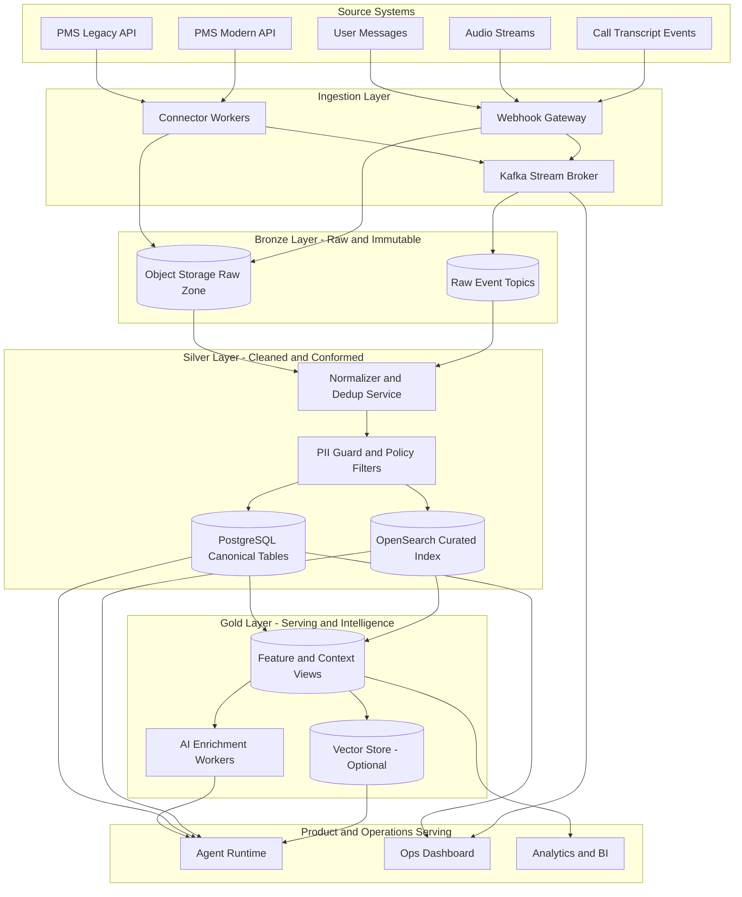
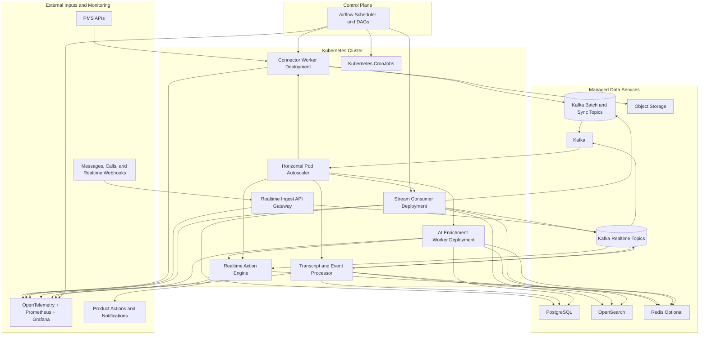

# Lightwork Data Engineer Takeaway

Author: egenc  
Role target: Lead Data Engineer / Data Architect  
Date: 2026-08-15

## Purpose

This repository presents an end-to-end, startup-conscious data platform design for Lightwork.

## Quick Navigation

- Start here: `docs/01-requirements-assumptions.md`
- Q1 answer: `docs/02-ingestion-architecture.md`
- Q2 answer: `docs/03-realtime-processing.md`
- Q3 answer: `docs/04-ai-enrichment-benchmarking.md`
- Q4 answer: `docs/05-scaling-and-operations.md`
- Tooling rationale: `docs/06-tooling-explained.md`
- Explicit stack and role fit: `docs/09-tech-stack-and-role-fit.md`
- Concrete schema and mappings: `schemas/postgres_schema.sql`, `schemas/opensearch_mappings.json`

## How to Read This in 10 Minutes

1. Read the assumptions and constraints.
2. Review the architecture diagram and proposed stack.
3. Scan each question answer doc for decisions and trade-offs.
4. Check schema and scaling thresholds for implementation readiness.

It answers the four prompts from the take-home:

1. PMS ingestion (legacy and modern APIs)
2. Real-time processing for messages, audio, and transcripts
3. Agentic AI integration and benchmarking
4. Scaling strategy and intervention thresholds

The design goals are:

- Deliver business value quickly with a lean team
- Keep cloud spend under control
- Protect sensitive tenant and contact data
- Stay adaptable as product requirements evolve

## Executive Summary

I propose a **two-lane architecture**:

- **Batch/near-real-time lane** for PMS ingestion and normalization
- **Streaming lane** for live events (messages, audio, transcript updates)

Both lanes converge into a shared data foundation with:

- PostgreSQL for transactional and curated relational data
- Object storage for immutable raw payloads and large media files
- OpenSearch for low-latency text retrieval and semantic filtering
- Optional vector index for RAG-style retrieval by AI agents

This supports a practical maturity path:

- Phase 1 (MVP): reliable ingestion + human-readable audit trails
- Phase 2: event-driven processing + basic AI enrichment
- Phase 3: strict SLOs, stronger observability, and scale automation

## Proposed Tech Stack (LightWork-Aligned)

This stack is intentionally aligned with the role requirements and startup constraints.

### Data and Processing

- Python 3.12: connector services, stream consumers, AI enrichment workers
- Kafka (or Redpanda): real-time event transport and replay
- Airflow: scheduled sync, reconciliation, backfills
- PostgreSQL: canonical operational data and action/audit records
- MongoDB: flexible document storage for evolving integration metadata and non-canonical payload views
- OpenSearch: full-text search for messages/transcripts and operational filters
- pgvector initially, Qdrant at higher scale: semantic retrieval for agentic AI
- Redis (optional but valuable): low-latency cache, rate limiting, and short-lived workflow state
- Object storage (S3/GCS/Azure Blob): immutable raw payloads, audio, transcript snapshots

### Platform and Reliability

- Kubernetes: deployment, autoscaling, workload isolation
- OpenTelemetry + Prometheus + Grafana: metrics, tracing, alerting
- Great Expectations (or contract checks): source quality and schema drift controls

### Why this specific mix

- Covers relational + NoSQL + vector requirements from the job spec
- Supports both batch and real-time workloads
- Keeps first implementation realistic for a small team
- Preserves headroom to scale without immediate re-platforming

## Role Alignment to Job Description

- Architect and scale data pipelines: two-lane architecture with explicit scale thresholds
- Build batch + real-time processing: Airflow + Kafka/consumers split by workload profile
- Support AI retrieval and ML workflows: OpenSearch + vector retrieval + inference audit tables
- Reliability and governance: idempotency keys, DLQ, replay, policy gates, tenant scoping
- Observability and quality: lag/error/latency dashboards with data quality contracts
- Founding data hire impact: ADRs, standards, and phased operating model included in this repo

## Repo Structure

- `docs/01-requirements-assumptions.md`: explicit assumptions and non-goals
- `docs/02-ingestion-architecture.md`: PMS ingestion architecture and trade-offs
- `docs/03-realtime-processing.md`: stream processing, storage, retrieval, schema
- `docs/04-ai-enrichment-benchmarking.md`: agentic AI usage and performance evaluation
- `docs/05-scaling-and-operations.md`: scaling plan and intervention thresholds
- `docs/06-tooling-explained.md`: why each tool exists and what problem it solves
- `docs/09-tech-stack-and-role-fit.md`: explicit stack selection and responsibility mapping
- `schemas/postgres_schema.sql`: core relational schema
- `schemas/opensearch_mappings.json`: search index mappings for message/transcript retrieval
- `infra/k8s/reference-deployment.yaml`: sample Kubernetes deployment pattern
- `adr/ADR-001-platform-shape.md`: architecture decision record

## Architecture Overview

## Orchestration and Runtime Architecture (Airflow + Kubernetes)

## Why This Fits a Startup

- Uses proven, boring components first (Postgres, object storage, queue/stream)
- Prioritizes idempotency, replay, and auditability to reduce operational surprises
- Scales with incremental upgrades instead of a costly big-bang platform
- Keeps optional components (vector DB, data lakehouse, Flink) as phase-gated upgrades

## Security and Compliance Baseline

- Encrypt data at rest and in transit
- Field-level protection for PII (name, email, phone, address)
- Tenant-scoped access controls and row-level security patterns
- Immutable audit log for data access and model actions
- Time-bound retention policies by data class (event, transcript, raw media)

## How to Review

1. Read assumptions first
2. Review ingestion design and connector strategy
3. Review real-time processing and schema
4. Review AI section, especially benchmarking and guardrails
5. Review scaling thresholds for when to intervene

## Optional Next Step

If this were moving to implementation, the first sprint would include:

- One PMS connector (modern API)
- One legacy PMS adapter
- Message ingestion path with dedupe and storage
- AI enrichment for classification + action recommendation
- Dashboard with ingestion lag, error rate, and model quality
