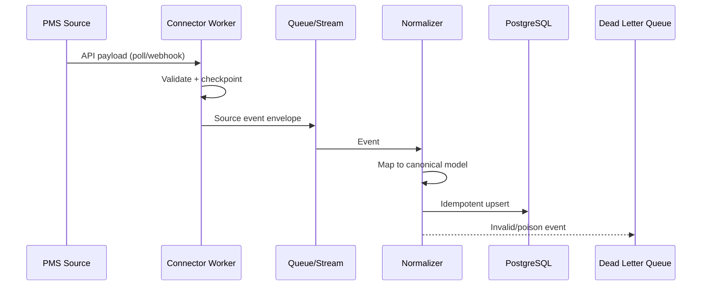

# 1) PMS Ingestion Architecture

## What We Are Solving

We need to import tenancy and personal data from many PMS platforms with uneven API maturity.

Challenges:

- Legacy APIs may be unstable, rate-limited, and weakly documented
- Modern APIs may support webhooks, pagination tokens, and clean upsert semantics
- We need one internal canonical model despite source diversity

## Recommended Pattern

Use a **connector framework** with source-specific adapters and a shared ingestion contract.

### Core Ideas

- One adapter per PMS source system
- Unified event envelope for all incoming records
- Raw payload persistence before transformation
- Idempotent upsert into canonical tables
- Dead-letter queue for poison records

## Data Flow

## Connector Techniques

### Legacy PMS APIs

- Polling with adaptive schedule
- Watermark checkpoints by update timestamp and source primary key
- Retry with exponential backoff and jitter
- Circuit breaker to avoid cascading partner outages
- Defensive parsing for loosely typed payloads

### Modern PMS APIs

- Webhook ingestion when available
- Signature verification and replay protection
- Incremental sync endpoints for reconciliation
- Use provider cursor tokens for consistency

## Canonical Data Model Strategy

Map source schemas into internal entities:

- person
- tenancy
- address
- household_membership
- source_record_map

Store source metadata to preserve traceability:

- source_system
- source_entity
- source_id
- source_updated_at
- raw_payload_uri
- ingestion_run_id

## Framework Choices

### Option A: Airbyte (or equivalent)

- Fast time to first connector
- Good for standard connectors
- Useful if many APIs are straightforward

Trade-off:

- Custom behavior for unstable legacy APIs may still require custom code

### Option B: Custom connector service on Kubernetes

- More control over retries, schema handling, and business rules
- Better fit for difficult legacy systems

Trade-off:

- Higher engineering ownership

### Recommended Hybrid

- Use Airbyte/Fivetran-style managed connectors where stable and cheap
- Use custom connectors for problematic legacy PMS platforms

This minimizes build effort while preserving flexibility.

## Deployment Approach

Kubernetes is appropriate for:

- Connector workers (stateless)
- Normalization workers
- Queue consumers

Suggested add-ons:

- External Secret Manager integration
- Horizontal Pod Autoscaler by queue lag
- CronJobs for reconciliation sync

## Reliability Controls

- Idempotency key: (source_system, source_entity, source_id, source_updated_at)
- Exactly-once effect at storage boundary via upsert constraints
- Structured error taxonomy (retryable vs non-retryable)
- Replay support from raw event/object storage
